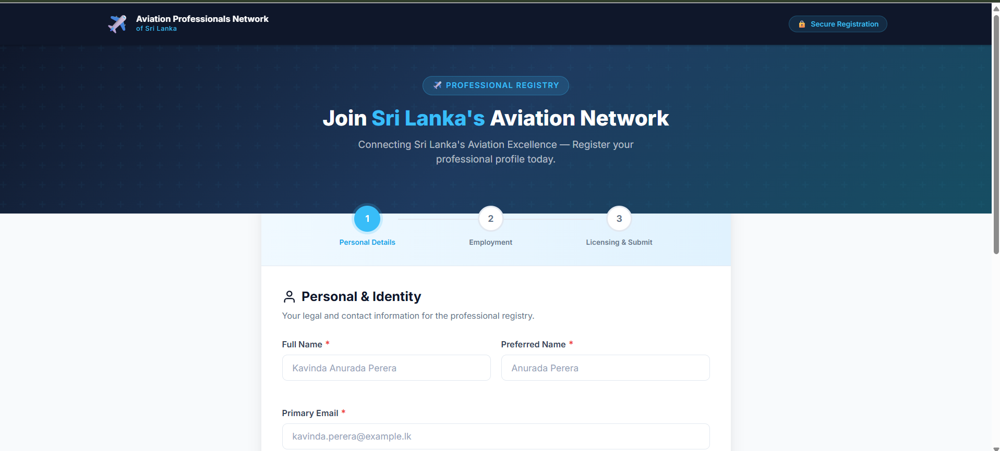
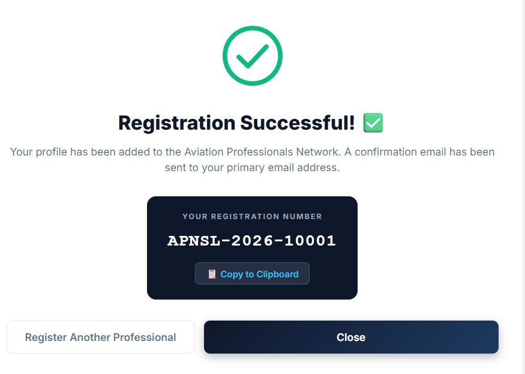
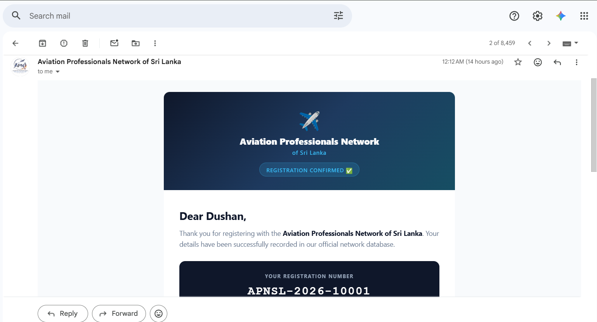

<div align="center">


# ✈️ Aviation Professionals Network — Sri Lanka
### Registration Portal & Admin Dashboard

**Connecting Sri Lanka's Aviation Excellence** — a production-ready registration platform for aviation professionals, built entirely inside Google's ecosystem with **zero external dependencies**.

<br/>


</div>

---

## 📖 Table of Contents

- [Overview](#-overview)
- [Screenshots](#-screenshots)
- [Features](#-features)
- [Tech Stack](#️-tech-stack)
- [Project Structure](#-project-structure)
- [Deployment Guide](#-deployment-guide)
- [Google Sheets Schema](#-google-sheets-schema)
- [Script Properties](#️-script-properties)
- [Deployment Checklist](#-deployment-checklist)
- [License](#-license)

---

## 🔭 Overview

The **Aviation Professionals Network (APN) of Sri Lanka** portal lets aviation professionals — pilots, engineers, ATC officers, ground crew, and more — register themselves into an official, centralized registry. Every submission is validated, deduplicated, written straight to Google Sheets, and confirmed with a branded HTML email carrying a unique registration number.

No servers, no databases, no hosting bills — just Google Apps Script, Sheets, and Gmail working together.

---

## 📸 Screenshots

<div align="center">

### 1️⃣ Multi-Step Registration Form
*A guided 3-step wizard — Personal Details → Employment → Licensing & Submit*



<br/><br/>

### 2️⃣ Instant Confirmation
*Animated success screen with a copyable, auto-generated registration number*



<br/><br/>

### 3️⃣ Branded Confirmation Email
*A polished HTML email — compatible with Gmail, Outlook, and Apple Mail*



</div>

---

## ✨ Features

### 📝 Registration Form
- **3-step wizard** — Personal Details → Employment → Licensing & Submit
- **15 fields** with full client-side and server-side validation
- Real-time blur validation with shake animations on errors
- Conditional fields — Base Airport (required for operational roles), License Type (required if a CAASL No. is provided)
- Automatic phone number normalisation to the `+94` prefix
- Review & Confirm step before final submission
- Animated SVG checkmark success screen with a copyable registration number

### ⚙️ Backend (`Code.gs`)
- `doGet(e)` — serves the HTML app
- `processFormSubmission(payload)` — validates, deduplicates, writes to sheet, sends email
- `verifyAdminPassword(password)` — password gate for the dashboard
- `getAdminData(password)` — returns registry rows for the dashboard
- Registration numbers formatted as `SL-AERO-YYYY-XXXX` (auto-incrementing, resets each year)
- Duplicate detection on **email** (Column E) and **CAASL License No.** (Column N)
- Rate limiting — max 3 submissions/hour per user (tracked in a `RateLimit` sheet)
- HTML sanitisation on every input

### 🔐 Admin Dashboard (`?view=admin`)
- Password-gated, with a shake animation on incorrect entry
- Live stats cards — Total Registrations, This Month, Email Failures, Unique Categories
- Sortable, filterable, searchable data table (25 rows per page)
- One-click export — Filtered CSV or Full CSV
- Failed email rows highlighted in red for quick triage

### 📧 Email Confirmation
- Professional HTML email with inline CSS for maximum client compatibility
- Navy header, registration number badge, and a full submitted-details table
- Templated with Google Apps Script scriptlets (`<?= variable ?>`)

---

## 🏗️ Tech Stack

| Layer | Technology |
|---|---|
| **Frontend** | Vanilla HTML5 · CSS3 (Flexbox/Grid) · ES6+ JavaScript |
| **Backend** | Google Apps Script (V8 runtime) |
| **Database** | Google Sheets (`Registry` sheet) |
| **Email** | Google MailApp / GmailApp |
| **Auth** | Script Properties (admin password) |

---

## 📁 Project Structure

```
Aviation_Database/
├── Assets/
│   ├── screenshots/          # README screenshots
│   └── ...                   # Logo, QR code, source data dictionary
├── Code.gs                   # Google Apps Script backend
├── Index.html                # Frontend: registration form + admin dashboard
├── EmailTemplate.html        # HTML confirmation email template (inline CSS)
├── .gitignore
└── README.md
```

---

## 🚀 Deployment Guide

### 1. Create a Google Apps Script project
1. Go to [script.google.com](https://script.google.com) → **New project**
2. Paste `Code.gs` into the default script tab
3. **File → New → HTML file** → name it `Index` → paste `Index.html`
4. **File → New → HTML file** → name it `EmailTemplate` → paste `EmailTemplate.html`
5. Attach a Google Spreadsheet via **Resources → Cloud Platform project**, or let the script auto-create sheets

### 2. Set the admin password *(run once)*
In the script editor, select `setupScriptProperties` from the function dropdown and click **▶ Run**.
Default password: `AviationAdmin@2026` — **change this before going live**.

### 3. Deploy as a Web App
- **Deploy → New deployment → Web App**
- Execute as: **Me**
- Who has access: **Anyone**
- Copy the deployment URL

### 4. Access the admin dashboard
Navigate to `<YOUR_URL>?view=admin`

---

## 📊 Google Sheets Schema

Sheet name: `Registry`

| Col | Header | Notes |
|---|---|---|
| A | Timestamp | Auto |
| B | Registration Number | `SL-AERO-YYYY-XXXX` |
| C | Full Name | |
| D | Preferred Name | |
| E | Primary Email | **Unique** |
| F | Primary Contact No. | Normalised to `+94…` |
| G | Secondary Contact No. | |
| H | Permanent Address | |
| I | Current Employer | |
| J | Job Category | |
| K | Job Title | |
| L | Primary Base Airport | |
| M | Employment Status | |
| N | CAASL License No. | **Unique if provided** |
| O | License Type | |
| P | Type Ratings | |
| Q | Total Experience / Hours | |
| R | Email Sent Status | `SENT` / `FAILED` / `PENDING` |

---

## ⚙️ Script Properties

| Key | Value | Set by |
|---|---|---|
| `ADMIN_PASSWORD` | Your secure password | `setupScriptProperties()` |

---

## 📋 Deployment Checklist

- [ ] Web app deployed — Execute as: Me, Access: Anyone
- [ ] `Registry` sheet has headers in Row 1
- [ ] `setupScriptProperties()` run with a secure password
- [ ] Test: 1 valid submission → confirmation email received
- [ ] Test: duplicate email → error toast shown
- [ ] Test: duplicate CAASL → error toast shown
- [ ] Mobile verified at 375px and 768px

---

## 📄 License

© 2026 Aviation Professionals Network of Sri Lanka. All rights reserved.

<div align="center">
<sub>Built with ✈️ for Sri Lanka's aviation community</sub>
</div>
